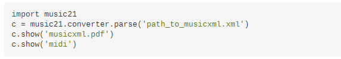

# melodia-composer-azf

You can use "Runner" class on base package for testing methods. You should set up a run configuration with these 
environment variables:

For local executions, configure Azure Key Vault
```
KEY_VAULT_NAME: name of key vault
KEY_VAULT_CLIENT_ID: client id of key vault
KEY_VAULT_CLIENT_SECRET: client secret of key vault
```

